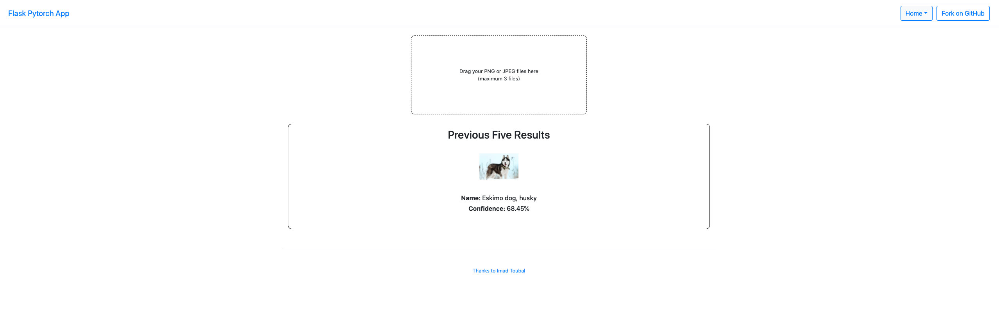

# Session 3 - Containerization and Docker - Flask - Pytorch - Docker 

The documentation explains how to get up and running with either virtualenv or Docker.



This website is deployed in Heroku: https://fast-mountain-21864.herokuapp.com/

By default, this app uses MobileNetV2 image classifier that was pre-trained on the ImageNet dataset. This can be easily changed with any custom deep learning model.

## Getting Started (using Python virtualenv)

You need to have Python installed in your computer.

1. Install `virtualenv`:
    ```
    pip install virtualenv
    ```
2. Create a Python virtual environment:
    ```
    virtualenv venv
    ```
3. Activate virtual environment:
    1. Windows:
    ```
    cd venv\Scripts
    activate
    cd ..\..
    ```
    2. Lunix / Mac:
    ```
    source venv/bin/activate
    ```
4. Install libraries:

   ```
   pip install -r requirements.txt
   ```

### Run the code

* Run the app:
    ```
    flask run
    ```
* Run on a specific port:
    ```
    flask run -p <port>
    ```

## Getting Started (using Docker)

1. Create a Docker image
    ```
    docker build -t pytorchflask .
    ```
    This will create an image with the name `pytorchflask`. You can replace that with a custom name for your app.

2. Run the docker image
    ```
    docker run -d -p 127.0.0.1:5000:80 pytorchflask
    ```
    This will run the app on port `5000`. You can replace that with which ever port that is more suitable.

## Deploying to Heroku

- Create Heroku app
    ```
    heroku create
    git push heroku master
    ```

OR

- Add to existing Heroku app
    ```
    heroku git:remote -a <your-app-name>
    git push heroku master
    ```
